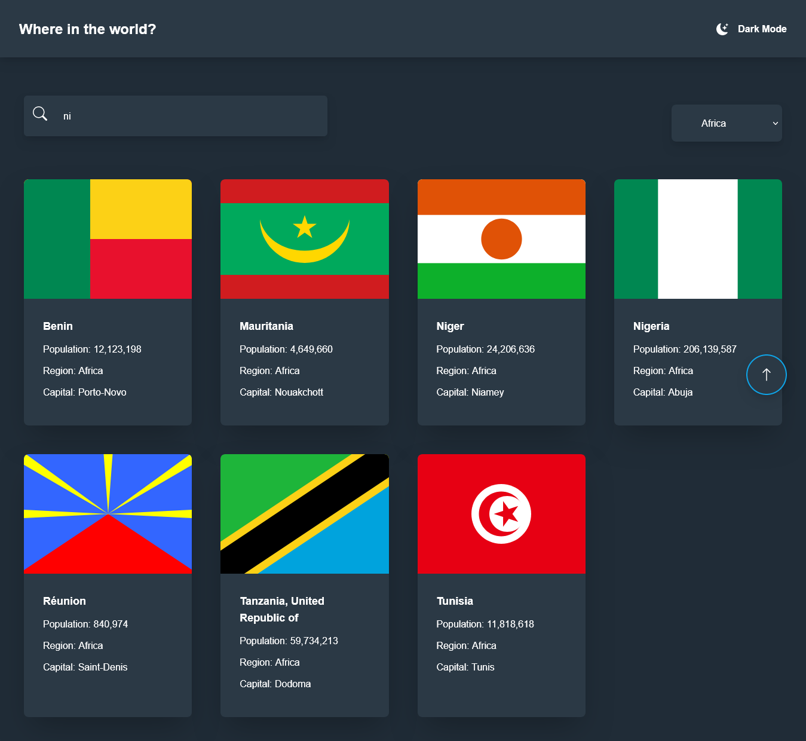

# Frontend Mentor - REST Countries API with color theme switcher solution

This is a solution to the [REST Countries API with color theme switcher challenge on Frontend Mentor](https://www.frontendmentor.io/challenges/rest-countries-api-with-color-theme-switcher-5cacc469fec04111f7b848ca). Frontend Mentor challenges help you improve your coding skills by building realistic projects. 

## Table of contents

- [Overview](#overview)
  - [The challenge](#the-challenge)
  - [Screenshot](#screenshot)
  - [Links](#links)
- [My process](#my-process)
  - [Built with](#built-with)
  - [What I learned](#what-i-learned)
  - [Continued development](#continued-development)
  - [Useful resources](#useful-resources)
- [Author](#author)
- [Acknowledgments](#acknowledgments)

## Overview

### The challenge

Users should be able to:

- See all countries from the API on the homepage
- Search for a country using an `input` field
- Filter countries by region
- Click on a country to see more detailed information on a separate page
- Click through to the border countries on the detail page
- Toggle the color scheme between light and dark mode *(optional)*

### Screenshot



### Links

- Solution URL: [Add solution URL here](https://your-solution-url.com)
- Live Site URL: [Add live site URL here](https://your-live-site-url.com)

## My process

### Built with

- Semantic JSX markup
- CSS variables
- Flexbox
- CSS Grid
- Mobile-first workflow
- [React](https://reactjs.org/) - JS library
- [Framer Motion](https://Framer.motion.com/) - React Animation library
- [Tailwind Css](https://tailwindcss.com/) - For styles

### What I learned

Use this section to recap over some of your major learnings while working through this project. Writing these out and providing code samples of areas you want to highlight is a great way to reinforce your own knowledge.

To see how you can add code snippets, see below:

- I Learned how to format population using Intl.NumberFormat() function
```jsx
new Intl.NumberFormat().format(country.population)
```
- I Learned how to create a multipage application using React Router DOM
```jsx
import { createBrowserRouter, RouterProvider } from "react-router-dom";

const router = createBrowserRouter([
  {
    path: "/",
    element: <Countries />,
    errorElement: <ErrorPage />,
  },
  {
    path: "/country/:name",
    element: <CountryDetails />,
    errorElement: <ErrorPage />,
  },
]);

function App() {
  return (
    <>
      <Header />
      <RouterProvider router={router} />
    </>
  );
}

export default App;

```

If you want more help with writing markdown, we'd recommend checking out [The Markdown Guide](https://www.markdownguide.org/) to learn more.


### Continued development

Use this section to outline areas that you want to continue focusing on in future projects. These could be concepts you're still not completely comfortable with or techniques you found useful that you want to refine and perfect.

I want to focus on creating Complex Animation Using React library like Framer Motion

### Useful resources

- [Example resource 1](https://www.example.com) - This helped me for XYZ reason. I really liked this pattern and will use it going forward.
- [Example resource 2](https://www.example.com) - This is an amazing article which helped me finally understand XYZ. I'd recommend it to anyone still learning this concept.


## Author

- Website - [Raphael](https://www.your-site.com)
- Frontend Mentor - [@yourusername](https://www.frontendmentor.io/profile/yourusername)
- Twitter - [@dev_raph_](https://www.twitter.com/yourusername)

## Acknowledgments
Nobody actually helped me in coding this challenge, and countributions are not accepted for this repository. Feel free to fork this repository and modify the code as you wish.

This is where you can give a hat tip to anyone who helped you out on this project. Perhaps you worked in a team or got some inspiration from someone else's solution. This is the perfect place to give them some credit.